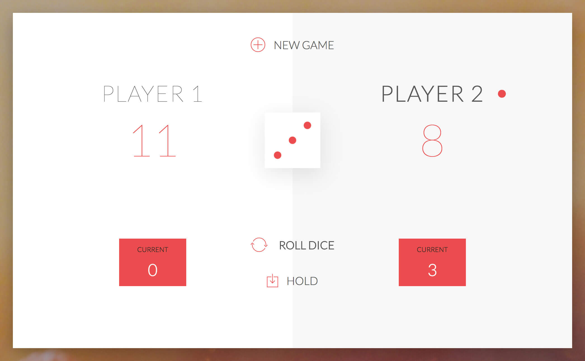

# DOM Pig Game
A javaScript game included in [The Complete JavaScript Course: Build a Real-World Project](https://www.udemy.com/the-complete-javascript-course/) by Jonas Schmedtmann on Udemy.

I am building on it.

You can play it [here](https://viery365.github.io/dom-pig-game/).

Game Rules:

- The game has 2 players, playing in rounds
- In each turn, a player rolls a dice as many times as he whishes. Each result get added to his ROUND score
- BUT, if the player rolls a 1, all his ROUND score gets lost. After that, it's the next player's turn
- The player can choose to 'Hold', which means that his ROUND score gets added to his GLOBAL score. After that, it's the next player's turn
- The first player to reach 100 points on GLOBAL score wins the game
